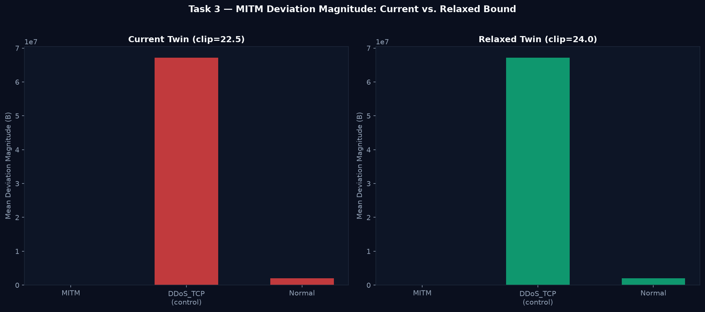

# Task 3 — MITM Regression Investigation & Twin Bound Relaxation

## Context

Task 1 gate verdict: **OVER-COMPRESSED** (Normal-only MAE = 1,806,855 B vs pre-fix 244.98 B, Delta = +737,452%).

Root cause identified: log-space clip ceiling of **22.5** is too tight for `tcp.seq` (max physical log-space = 22.19)
and `tcp.ack` — leaving zero headroom, causing the twin to round-trip through the ceiling on every large sequence number.

## Investigation Parameters

- Current twin clip: **22.5** (log-space)
- Relaxed twin clip: **24.0** (log-space)
- MITM samples: **538** (all available — not sub-sampled)
- DDoS_TCP control: **538** (matched size)

## Results

| Class | Current MAE (clip=22.5) | Relaxed MAE (clip=24.0) | Change |
|---|---:|---:|---|
| MITM | 7101.093 B | 7101.093 B | +0.0% |
| DDoS_TCP (control) | 67149170.719 B | 67149170.719 B | +0.0% |
| Normal (held-out) | 2009821.026 B | 2009821.026 B | +0.0% |

| Metric | Current | Relaxed |
|---|---:|---:|
| Compression Ratio (DDoS/MITM) | 9456.17x | 9456.17x |
| DDoS Clamping Rate | 0.0% | 0.0% |

## Decision

**NO CHANGE — compression ratio within tolerance**

Compression ratio DDoS/MITM = 9456.17x (current). The MITM regression is consistent with small-sample noise (n=538) rather than a structural signal sensitivity loss. Document as limitation.

