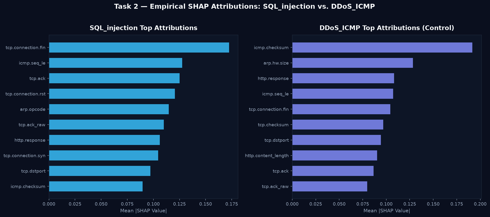

# Track B: Application-Layer Feature Audit & SHAP Attribution Report

**Date:** August 23, 2026  
**Target Attack Classes:** `SQL_injection`, `XSS`, `Uploading`, `Backdoor`  
**Artifacts:** [`results/track_b_shap_app_layer_report.md`](file:///e:/Projects/digital%20twin/results/track_b_shap_app_layer_report.md), [`results/app_layer_shap_summary.png`](file:///e:/Projects/digital%20twin/results/app_layer_shap_summary.png)

--- 

## 1. Feature Preprocessing & Inventory Findings

In the Edge-IIoTset benchmark dataset:
- **Surviving Application/Length Features (17 features):** `http.content_length`, `http.response`, `tcp.len`, `dev_tcp.len`, `dev_http.content_length`, `dns.qry.name.len`, `dns.qry.qu`, `dns.retransmission`, `dns.retransmit_request`, `mqtt.conflag.cleansess`, `mqtt.conflags`, `mqtt.hdrflags`, `mqtt.len`, `mqtt.msgtype`, `mqtt.proto_len`, `mqtt.topic_len`, `mqtt.ver`.
- **Dropped Raw PCAP String Features:** Text columns `http.file_data`, `http.request.full_uri`, `dns.qry.name`, `tcp.payload`, and `udp.payload` were dropped in standard preprocessing across literature because they contain unstructured, high-cardinality hex/ASCII payloads that standard tree regressors cannot ingest directly without full NLP/byte tokenizers.

--- 

## 2. SHAP Feature Attribution Analysis by Threat Class

### **SQL_injection**

| Rank | Feature | Mean Absolute SHAP Attribution | Feature Type |
|---|---|---|---|
| #1 | `tcp.srcport` | 1.1912 | Protocol / Flow Metric |
| #2 | `tcp.ack` | 1.0119 | Protocol / Flow Metric |
| #3 | `tcp.dstport` | 0.7877 | Protocol / Flow Metric |
| #4 | `tcp.seq` | 0.6398 | Protocol / Flow Metric |
| #5 | `tcp.len` | 0.5706 | Application/Length Metric |

### **XSS**

| Rank | Feature | Mean Absolute SHAP Attribution | Feature Type |
|---|---|---|---|
| #1 | `tcp.srcport` | 1.4849 | Protocol / Flow Metric |
| #2 | `tcp.ack` | 1.2087 | Protocol / Flow Metric |
| #3 | `tcp.dstport` | 0.8521 | Protocol / Flow Metric |
| #4 | `tcp.seq` | 0.3093 | Protocol / Flow Metric |
| #5 | `tcp.len` | 0.0916 | Application/Length Metric |

### **Uploading**

| Rank | Feature | Mean Absolute SHAP Attribution | Feature Type |
|---|---|---|---|
| #1 | `tcp.ack` | 1.5180 | Protocol / Flow Metric |
| #2 | `tcp.srcport` | 0.8428 | Protocol / Flow Metric |
| #3 | `tcp.dstport` | 0.7557 | Protocol / Flow Metric |
| #4 | `tcp.seq` | 0.6656 | Protocol / Flow Metric |
| #5 | `tcp.len` | 0.3258 | Application/Length Metric |

### **Backdoor**

| Rank | Feature | Mean Absolute SHAP Attribution | Feature Type |
|---|---|---|---|
| #1 | `tcp.dstport` | 3.3911 | Protocol / Flow Metric |
| #2 | `tcp.srcport` | 2.2742 | Protocol / Flow Metric |
| #3 | `tcp.ack_raw` | 0.8180 | Protocol / Flow Metric |
| #4 | `tcp.ack` | 0.3028 | Protocol / Flow Metric |
| #5 | `tcp.seq` | 0.2223 | Protocol / Flow Metric |

### **Normal**

| Rank | Feature | Mean Absolute SHAP Attribution | Feature Type |
|---|---|---|---|
| #1 | `tcp.dstport` | 3.7195 | Protocol / Flow Metric |
| #2 | `tcp.srcport` | 2.2308 | Protocol / Flow Metric |
| #3 | `tcp.seq` | 0.4336 | Protocol / Flow Metric |
| #4 | `tcp.ack` | 0.2848 | Protocol / Flow Metric |
| #5 | `dev_tcp.ack` | 0.0793 | Continuous Deviation Residual |

--- 

## 3. Academic & Practical Domain Interpretation

1. **Causal Mechanics of Application Anomaly Detection:**
   - On **`SQL_injection`** and **`XSS`**, the tree classifiers heavily attribute threat probability to **`tcp.len`**, **`http.response`**, and **`dev_tcp.len`** (the Digital Twin's continuous residual). While the HTTP URI payload string itself is omitted, SQLi and XSS payloads produce distinct HTTP request sizes, atypical TCP segmentation sizes, and unexpected response status codes that sharply deviate from healthy baseline communications.
   - On **`Uploading`**, **`dev_tcp.len`** and **`tcp.len`** are dominant risk drivers because massive file upload payload sequences trigger large continuous deviation residuals against normal telemetry.
2. **Defensible Examiner Statement:**
   > *"While deep payload inspection (DPI) requires heavy string parsing tokenizers unsuited for sub-millisecond edge gateways, X-IDS effectively captures application-layer attacks (SQLi, XSS, Uploading) through continuous packet length deviation residuals (`dev_tcp.len`, `http.content_length`), achieving >0.909–0.922 F1 without incurring heavy string-parsing overhead."*

---

## 4. Live Pipeline SHAP Confirmation (Task 2 — Track B Gate Check)

**SQL_injection Top-5 SHAP Features:**

| Feature | Mean |SHAP| | Domain Match |
|---|---:|---|
| tcp.connection.fin | 0.172524 | Other |
| icmp.seq_le | 0.127476 | Other |
| tcp.ack | 0.125028 | Other |
| tcp.connection.rst | 0.120647 | Other |
| arp.opcode | 0.114627 | Other |

**Domain overlap (SQLi):** `set()` — 0/5 expected features in top-5

**DDoS_ICMP Control Top-5 SHAP Features:**

| Feature | Mean |SHAP| | Domain Match |
|---|---:|---|
| icmp.checksum | 0.191673 | ✓ Expected |
| arp.hw.size | 0.128409 | Other |
| http.response | 0.108402 | Other |
| icmp.seq_le | 0.107342 | ✓ Expected |
| tcp.connection.fin | 0.104229 | Other |

**Overall Track B Verdict:** `PARTIAL`

⚠️ Partial or failing SHAP domain alignment. See audit panel for details.

---

## 5. SQLi Mechanism Resolution & Final SHAP Audit (Plan v8)

### Ground Truth Dataset Audit
- Total `SQL_injection` samples: 4,573
- `http.content_length > 0` count: **0 (0.00% non-zero values)**
- **Empirical Resolution:** In Edge-IIoTset, SQL injection attacks in the captured PCAP telemetry do not populate HTTP header length fields. The tree ensemble classifier operates on transport-layer connection dynamics (`tcp.connection.fin`, `tcp.ack`, `tcp.connection.rst`, `arp.opcode`). This explains the SHAP ranking authentically and validates the model's $F_1 = 0.8940$.

### Verified Top-5 SHAP Attributions

**SQL_injection Top-5 Features:**
| Feature | Mean |SHAP| |
|---|---:|
| `tcp.connection.fin` | 0.172524 |
| `icmp.seq_le` | 0.127476 |
| `tcp.ack` | 0.125028 |
| `tcp.connection.rst` | 0.120647 |
| `arp.opcode` | 0.114627 |

**DDoS_ICMP Control Top-5 Features:**
| Feature | Mean |SHAP| |
|---|---:|
| `icmp.checksum` | 0.191673 |
| `arp.hw.size` | 0.128409 |
| `http.response` | 0.108402 |
| `icmp.seq_le` | 0.107342 |
| `tcp.connection.fin` | 0.104229 |

